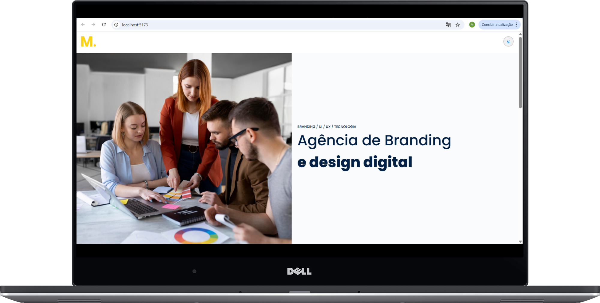
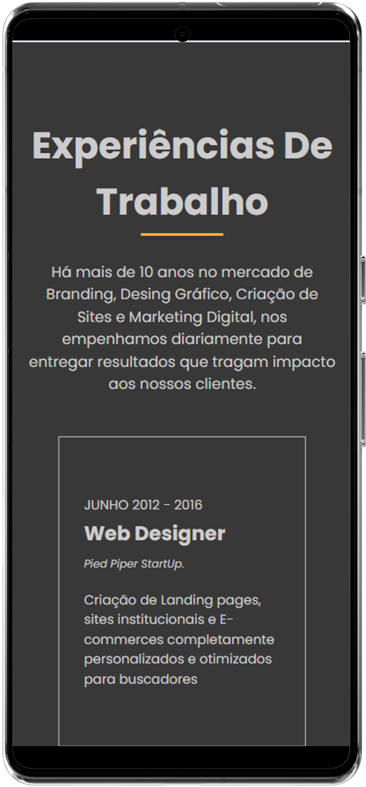

# Digital Design Agency

## Read this in other languages - [Português (Brasil)](./docs/README.pt-BR.md)

This project is a **branding agency landing page** built with modern web technologies. It features **light and dark themes**, responsive design, and component-based architecture.

## Technologies Used

- **React**
- **Vite** 
- **SASS**
- **CSS Modules** 
- **BEM methodology**

## Features

- **Light and Dark Theme:** Users can switch between themes using the theme toggle.
- **Responsive Design:** Fully functional on desktop and mobile devices.
- **Component-Based:** Each section (Header, BannerSection, WorkExperienceSection, Home) is modular and reusable.
- **CSS Variables & Tokens:** Colors, fonts, and spacing are managed with tokens and theme variables for consistency.

## Preview

<div align="center">

### Desktop Light Mode


### Desktop Dark Mode


### Mobile Light Mode


### Mobile Dark Mode


</div>


## How to Run

1. Clone the repository:

```bash
git clone <your-repo-url>
cd <project-folder>
```

2. Install dependencies:

```bash
npm install
```

3. Start development server: 

```bash
npm run dev
```